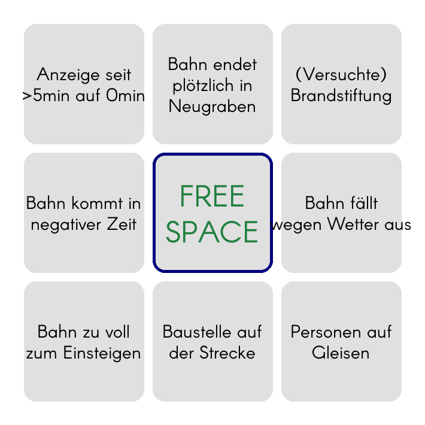
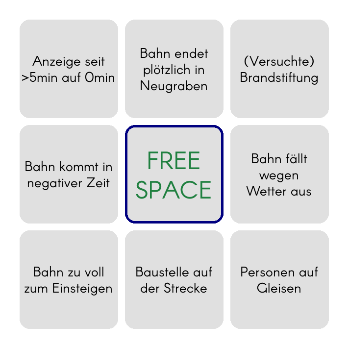

```python
>>> from main import BingoBoard
>>> board = BingoBoard(3,3)
>>> labels1 = BingoBoard.enterFieldLabels()
```

```
Enter label text (newlines allowed).
To go to next label, press Enter, then EOF
(Ctrl+D on Linux/Mac, Ctrl+Z on Windows).
When done, press EOF again.

|> Bahn zu voll   
|> zum Einsteigen
|> ^Z

Total labels entered: 1. Next label:
|> Anzeige seit
|> >5min auf 0min
|> ^Z

Total labels entered: 2. Next label:
|> Personen auf
|> Gleisen
|> ^Z

Total labels entered: 3. Next label:
|> Baustelle auf
|> der Strecke
|> ^Z

Total labels entered: 4. Next label:
|> Bahn kommt in
|> negativer Zeit
|> ^Z

Total labels entered: 5. Next label:
|> Bahn fällt                            
|> wegen Wetter aus
|> ^Z

Total labels entered: 6. Next label:
|> (Versuchte)
|> Brandstiftung
|> ^Z

Total labels entered: 7. Next label:
|> Bahn endet
|> plötzlich in
|> Neugraben
|> ^Z

Total labels entered: 8. Next label:
|> ^Z
```

```python
>>> board.fill(labels1, freeSpaceText="FREE\nSPACE")
>>> board.show(imgSavePath="board_v1.png", fontPath='Arcon-Regular') # if no imgSavePath is specified, will just show and not save
```



```python
>>> board.editFieldLabel(5)
```

```
Enter label text (newlines allowed).
When done, press Enter, then EOF
(Ctrl+D on Linux/Mac, Ctrl+Z on Windows).
|> Bahn fällt
|> wegen
|> Wetter aus
|> ^Z
```

```python
>>> board.show(imgSavePath="board_v2.png", boardStateSavePath="board_v2.json", fontPath='Arcon-Regular', fontSizeStd_px=28)
```



```python
>>> quit()
```

Now, the board state can be reloaded from the save file:
```python
>>> from main import BingoBoard
>>> board = BingoBoard.importState("board_v2.json")
>>> board.show(**board.savedLayout)
```